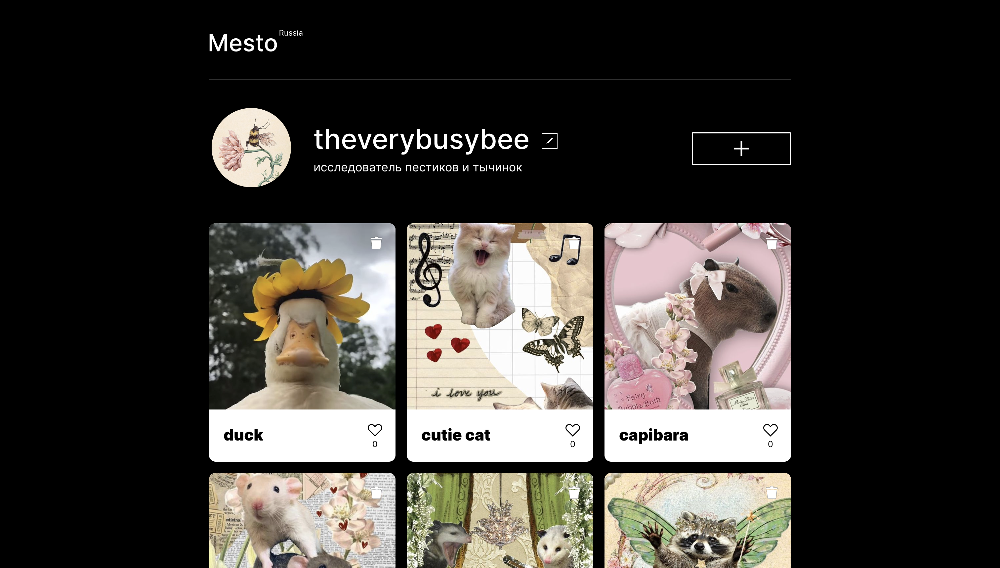

# Проект Mesto

## Tech Stack


## Demo



Задеплоенное приложение: https://theverybusybee.github.io/mesto-project/

## Запуск приложения

### Клонирование репозитория с проектом

```bash
git clone git@github.com:theverybusybee/mesto-project.git
```

### Установка зависимостей и запуск проекта

#### install dependencies
```bash
$ npm install
```

#### build project
```bash
$ npm run build
```

#### run prod mode
```bash
$ npm run dev
```

## Запуск приложения

Запустите [http://localhost:8080/](http://localhost:8080/), чтобы отобразить результат запуска.

## Description

Проект Mesto является своеобразной площадкой для размещения фотографий пользователями, отвечает требованиям кроссбраузерной адаптивной верстки. На данный момент реализован следующий функционал:

- Взаимодействие с сервером;
- Изменение ника/подписи/аватарки;
- Добавление новой фотокарточки;
- Удаление существующего поста;
- Добавление/удаление лайка;
- Счетчик лайков;
- Открытие/закрытие всплывающих модальных окон;
- Валидация форм;
- Проект реализован с использованием ООП.

## Links

* [Link to figma](https://www.figma.com/file/0h08hJ45behZsOPNH0V7g4/JavaScript.-Sprint-4-(Copy)?type=design&node-id=28212%3A155&mode=design&t=YonibnH0JshoqmoN-1)
